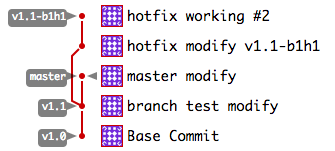
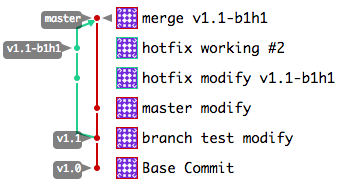
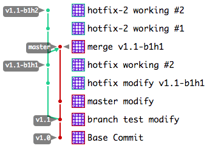

# 기본 처리 (본트렁크 기능 변경)
1. 형상서버에서 프로젝트 다운받기 (Clone)
   - git clone http://100.100.103.5/IPRON/IPRONv42.git
2. 로컬 파일수정/추가/삭제/commit
   - 로컬수정상태표시 : git status
   - 파일추가 : git add <파일이름>
3. 형상서버를 통해 로컬동기화
   - git fetch
3. 로컬 commit
   - git commit -a -m "[AddFn] IPR-0001 테스트작업"
4. 형상서버에 적용하기
   - git push
5. 로컬에서 Tag생성하기
   - git tag -a v4.2.0-b4h23 -m "IPRON v4.2.0-b4h23"
6. 형상서버에 tag전송하기
   - git push origin v4.2.0-b4h23

7. 로컬 브랜치추가
   - 목록보기 : git branch
   - 브랜치생성 : [ git branch IPR-2011 ] or [ git branch v4.2.0-b4h24 ]
   - 특정 테그에서 브랜치생성 : git branch v4.2.0-b4h24 v4.2.0-b4h23
   - 브랜치삭제 : git branch -d IPR-2011
   - 로컬작업위치 특정브랜치로 변경 : [ git checkout master ] or [ git checkout IPR-2011 ]
   [응용]
   - 특정테그에서 브랜치생성하고 로컬작업위치 변경 : git checkout -b v4.2.0-b4h24 v4.2.0-b4h23
8. 리모트 브랜치삭제
   - git push origin :serverfix

9. git push <remote> <branch>
10. 리모트 저장소의 내용을 로컬에 동기화
	> git fetch <remote>

# 빌드서버

# HotFix만들기

1. v1.1 버젼에서 v1.1-b1h1 Hotfix 만들기
   - v1.1 branch에서 v1.1-b1h1 으로 branch 생성하기
     > git checkout v1.1  
     > git branch v1.1-b1h1  
     > git checkout v1.1-b1h1  
     
		or
		  
     > git checkout v1.1  
     > git checkout -b v1.1-b1h1  
     
   - 현재 작업공간(branch) 확인하기
     > git branch -vv
     
     ```
     ➜  iVM git:(v1.1-b1h1) git branch
        master
        v1.1
      * v1.1-b1h1
     ```
   - 코드 수정
   - 수정본 로컬 commit
     > git status  
     > git add [filename] ...  
     > git commit -m "커밋 내역"  
     
     or
     
     > git commit -a -m "커밋 내역" 
   - 로컬변경사항 Git서버의 v1.1-b1h1 branch에 반영하기
     > git push origin v1.1-b1h1  

	     다음 push부터 "origin v1.1-b1h1" 을 생략하고 싶을때에는 "--set-upstream" 또는 -u 옵션을 추가하면, "git push" 만 이용할 수 있다.
     > git push --set-upstream origin v1.1-b1h1  

     
     
2. v1.1-b1h1 Hotfix내용 master에 반영하기(merge)
	- v1.1-b1h1을 master에 merge
     > git checkout master  
     > git merge v1.1-b1h1
   
   - 충돌난 코드 편집 (충돌발생시에만)

		```
		git:(master)# git merge v1.1-b1h1
		Auto-merging README.md
		CONFLICT (content): Merge conflict in README.md
		Automatic merge failed; fix conflicts and then commit the result.
		```
		충돌이 발생하면 발생한 파일의 내용이 아래와 같은 형식으로 충돌부분이 표시된다.

		```
		<<<<<<< HEAD
		HEAD에서 변경된 부분
		=======
		v1.1-b1h1에서 변경된 부분
		>>>>>>> v1.1-b1h1     
		```	

		해당내용중 "<<<<<<", "=====", ">>>>>>" 라인을 제거하고, 충돌발생한 코드의 두버젼을 하나로 합치는 작업을 수기로 한후 저장한다.

		```title:충돌내용
		<<<<<<< HEAD
		- master modify
		=======
		- branch v1.1-b1h1 hotfix working
		- branch v1.1-b1h1 hotfix working #2
		>>>>>>> v1.1-b1h1     
		```
		```title:보정내용
		- master modify
		- branch v1.1-b1h1 hotfix working
		- branch v1.1-b1h1 hotfix working #2
		```

   - 충돌난 코드 편집 후 로컬 commit하기 (충돌발생시에만)
		> git commit -a -m "merge v1.1-b1h1"

	- merge된 master Git서버에 반영
		> git push  

	

3. 기존 Hotfix v1.1-b1h1 에서 새로운 v1.1-b1h2 Hotfix 만들기
	> git checkout v1.1-b1h1  
	> git checkout -b v1.1-b1h2  
	> working  
	> git commit -a -m "hotfix-2 working #1"  
	> git push origin v1.1-b1h2  
	
	

# git flow 사용
1. 형상서버에서 프로젝트 다운받기 (Clone)
   - git clone http://100.100.103.5/IPRON/IPRONv42.git
2. git flow 시작하기
   - git flow init
3. 
